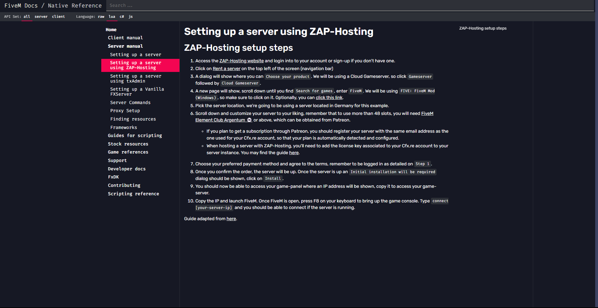
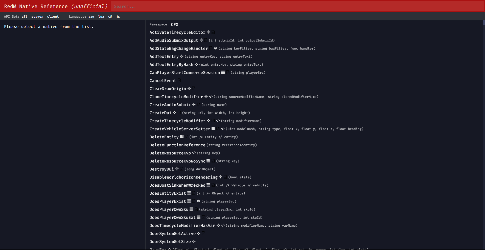

# FiveM Docs Dark Mode

## Overview
This Chrome extension enables dark mode for the CFX FiveM documentation and fan-made RedM documentation at [FiveM Docs](https://docs.fivem.net) and [RedM Docs](https://redm.disquse.me).

## Features
- Automatic dark mode theme based on OS settings

## Installation
1. Download the extension from the Chrome Web Store.
2. Enable the extension in your Chrome browser.

## Screenshots

## Changelog
- v1.0: Initial release

- v1.1: Added Support for Vehicles Models, Blips and Weapons

- v1.2: Added a Official Icon for the Extension

## Contributors
- [Faxes](https://github.com/FAXES)
- [JoeV2](https://github.com/Joe-Development)
